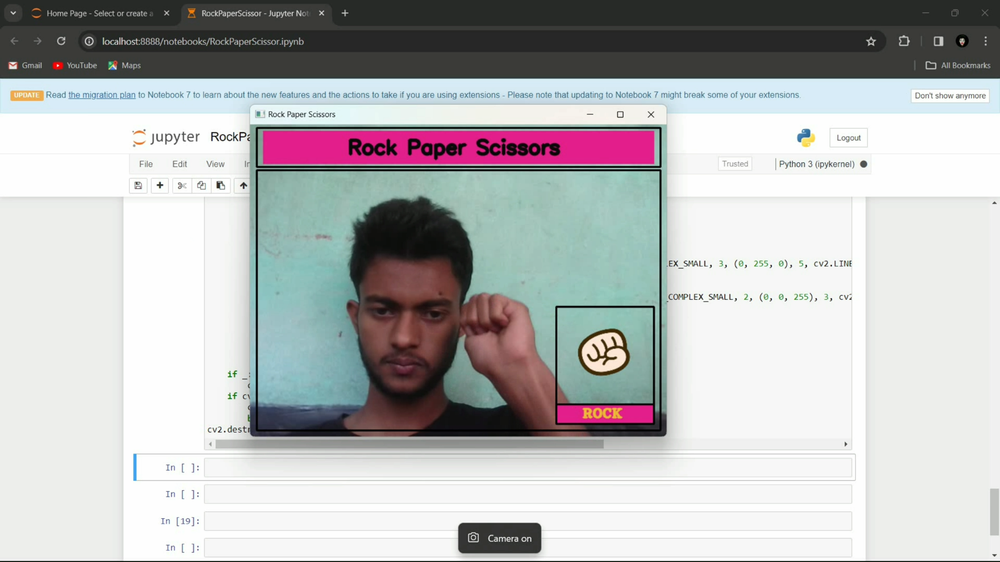
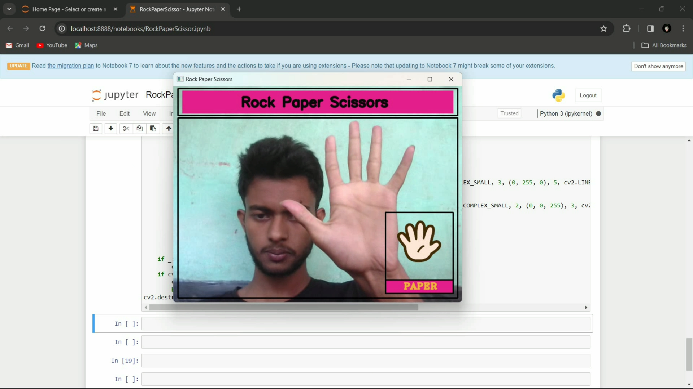
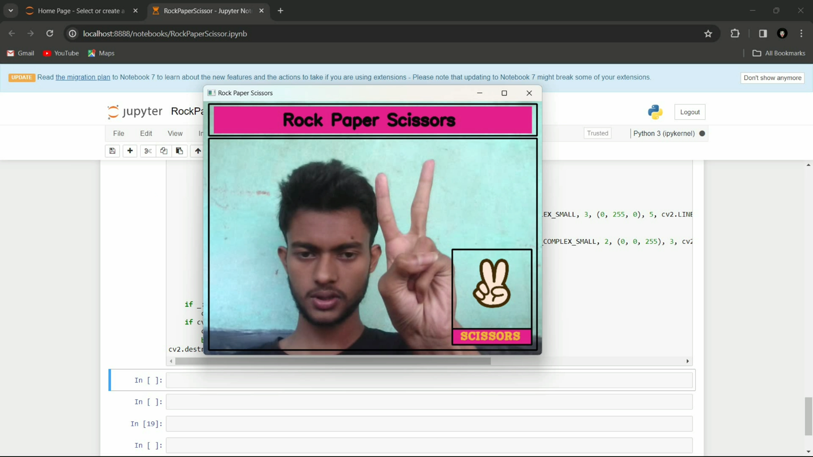
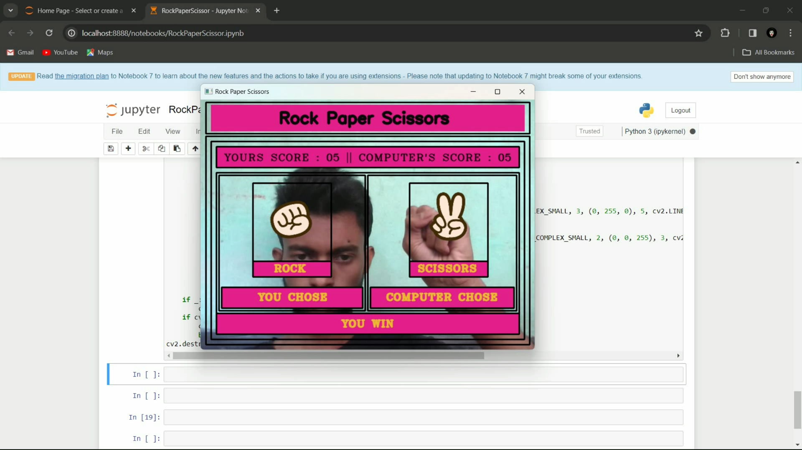

<h1 align='center'>Rock Paper Scissors</h1>




# Before Executing this code install this dependencies

```python
pip install opencv-python
pip install mediapipe
``` 

# Main Working Logic
   - ✊ Rock
   - 🖐️ Paper
   - ✌️ Scissors
   - 👍 It is use for starting the game (when you do this move you have 3 seconds to choose a move)
   - 🤘 It is use for exit from the score window
   - 🤟 It is use for exit from the winner window

# See the Notebook file there i write all things which you have to do if you want to use this repo :)
